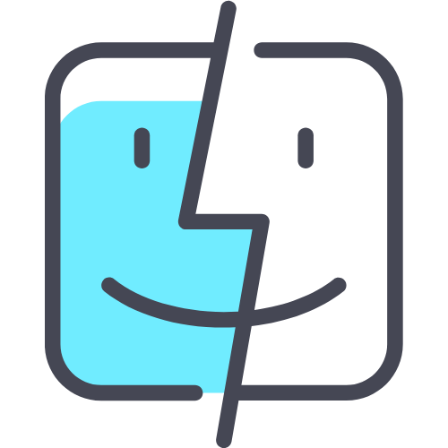

### Hi 👋

       I am a software engineer, I started my studies a year ago, being oriented in the middle of teaching at the Federal University Fluminense - UFF , but I sought to deepen my studies in programming, today I work with web and mobile development using javascript, typescript, React and react native
  

  <a href="https://github.com/ErickElc">
  
  

 
   
<h2 align="center">🛠️ &ensp; <i>P r i n c i p a i s    T e c n o l o g i a s</i></h2>

<table align="right" height="267px">
  <tr>
    <td align="center">
       
      
        <b>
          <pre>Javascript</pre>
        </b>
      
    </td>
     <td align="center">
       
      
        <b>
          <pre>Go</pre>
        </b>
      
    </td>
    <td align="center">
       
      
        <b>
          <pre>Typescript</pre>
        </b>
      
    </td>
     <td align="center">
       
      
        <b>
          <pre>ReactJS</pre>
        </b>
      
    </td>
     <td align="center">
       
      
        <b>
          <pre>NodeJS</pre>
        </b>
      
    </td>
  </tr>
  <tr>
    <td align="center">
       
      
        <b>
          <pre>Express</pre>
        </b>
      
    </td>
    <td align="center">
       
      
        <b>
          <pre>HTML5</pre>
        </b>
      
    </td>
     <td align="center">
       
      
        <b>
          <pre>CSS3</pre>
        </b>
      
    </td>
    <td align="center">
       
      
        <b>
          <pre>Sass</pre>
        </b>
      
    </td>
    <td align="center">
       
      
        <b>
          <pre>React Native</pre>
        </b>
      
    </td>
  </tr>
  <tr>
    <td align="center">
       
      
        <b>
          <pre>Styled Components</pre>
        </b>
      
    </td>
    <td align="center">
       
      
        <b>
          <pre>Tailwind</pre>
        </b>
      
    </td>
    <td align="center">
       
      
        <b>
          <pre>&ensp;Axios&ensp;</pre>
        </b>
      
    </td>
    <td align="center">
       
      
        <b>
          <pre>Mongodb</pre>
        </b>
      
    </td>
    <td align="center">
       
      
        <b>
          <pre>PostgreSQL</pre>
        </b>
      
    </td>
  </tr>
  <tr>
    <td align="center">
       
      
        <b>
          <pre>VSCode</pre>
        </b>
      
    </td>
    <td align="center">
       
      
        <b>
          <pre>Terminal</pre>
        </b>
      
    </td>
    <td align="center">
       
      
        <b>
          <pre>MacOSX</pre>
        </b>
      
    </td>
  <td align="center">
       
      
        <b>
          <pre>redux</pre>
        </b>
      
    </td>
    <td align="center">
       
      
        <b>
          <pre>MaterialUI</pre>
        </b>
      
    </td>
  </tr>
</table>

  
  
       
 <!--  -->
        
        

 
   
  
  
   
  
 
  

